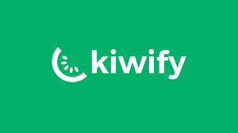
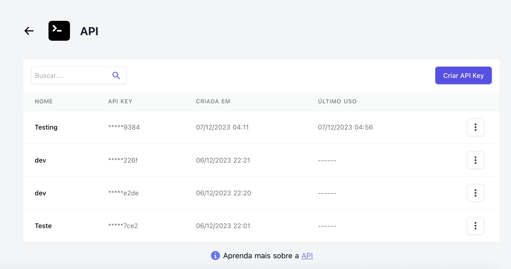
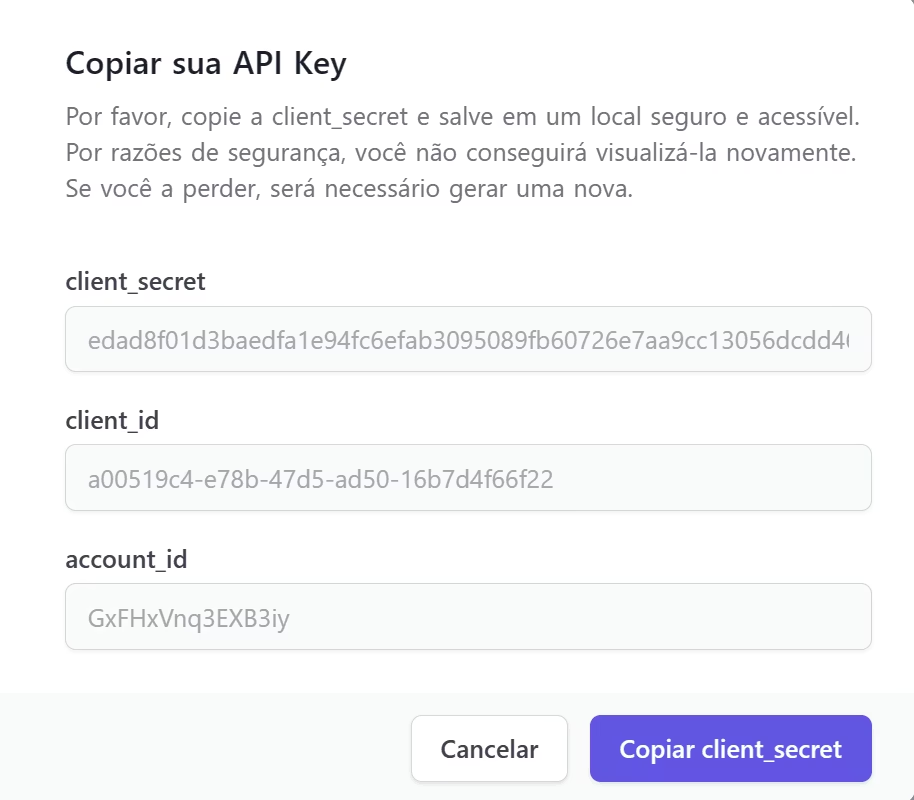

# mcp-kiwify

MCP server that wraps the [Kiwify](https://kiwify.com.br) public API as semantic tools for LLM agents.

Works with **Claude Code**, **Codex**, **Claude Desktop**, **Cursor**, **VS Code**, **Windsurf**, and any MCP-compatible client.

---

## Prerequisites

You need Kiwify API credentials. In your Kiwify dashboard, go to **Apps > API > Criar API Key**:



After creating the key, copy the three credentials shown in the modal:



| Variable               | Where to find                                                 |
| ---------------------- | ------------------------------------------------------------- |
| `KIWIFY_CLIENT_ID`     | `client_id` field in the modal                                |
| `KIWIFY_CLIENT_SECRET` | `client_secret` field (copy it now — it won't be shown again) |
| `KIWIFY_ACCOUNT_ID`    | `account_id` field in the modal                               |

## Installation

### Claude Code

```bash
claude mcp add kiwify \
  --transport stdio \
  -e KIWIFY_CLIENT_ID=your-client-id \
  -e KIWIFY_CLIENT_SECRET=your-client-secret \
  -e KIWIFY_ACCOUNT_ID=your-account-id \
  -- npx -y github:pauloFroes/mcp-kiwify
```

### Codex

Add to your Codex configuration:

```toml
[mcp_servers.kiwify]
command = "npx"
args = ["-y", "@paulofroes/mcp-kiwify"]
env_vars = ["KIWIFY_CLIENT_ID", "KIWIFY_CLIENT_SECRET", "KIWIFY_ACCOUNT_ID"]
```

### Claude Desktop

Add to `claude_desktop_config.json`:

```json
{
  "mcpServers": {
    "kiwify": {
      "command": "npx",
      "args": ["-y", "@paulofroes/mcp-kiwify"],
      "env": {
        "KIWIFY_CLIENT_ID": "your-client-id",
        "KIWIFY_CLIENT_SECRET": "your-client-secret",
        "KIWIFY_ACCOUNT_ID": "your-account-id"
      }
    }
  }
}
```

### Cursor

Add to `~/.cursor/mcp.json`:

```json
{
  "mcpServers": {
    "kiwify": {
      "command": "npx",
      "args": ["-y", "@paulofroes/mcp-kiwify"],
      "env": {
        "KIWIFY_CLIENT_ID": "your-client-id",
        "KIWIFY_CLIENT_SECRET": "your-client-secret",
        "KIWIFY_ACCOUNT_ID": "your-account-id"
      }
    }
  }
}
```

### VS Code

Add to `.vscode/mcp.json` in your project:

```json
{
  "servers": {
    "kiwify": {
      "command": "npx",
      "args": ["-y", "@paulofroes/mcp-kiwify"],
      "env": {
        "KIWIFY_CLIENT_ID": "your-client-id",
        "KIWIFY_CLIENT_SECRET": "your-client-secret",
        "KIWIFY_ACCOUNT_ID": "your-account-id"
      }
    }
  }
}
```

### Windsurf

Add to `~/.codeium/windsurf/mcp_config.json`:

```json
{
  "mcpServers": {
    "kiwify": {
      "command": "npx",
      "args": ["-y", "@paulofroes/mcp-kiwify"],
      "env": {
        "KIWIFY_CLIENT_ID": "your-client-id",
        "KIWIFY_CLIENT_SECRET": "your-client-secret",
        "KIWIFY_ACCOUNT_ID": "your-account-id"
      }
    }
  }
}
```

## Available Tools

| Tool                      | Description                            |
| ------------------------- | -------------------------------------- |
| `list_products`           | List all products                      |
| `get_product`             | Get product details by ID              |
| `list_sales`              | List sales with date range and filters |
| `get_sale`                | Get sale details by ID                 |
| `refund_sale`             | Refund a sale                          |
| `get_sales_stats`         | Get aggregated sales statistics        |
| `list_affiliates`         | List affiliates with filters           |
| `get_affiliate`           | Get affiliate details by ID            |
| `edit_affiliate`          | Update affiliate commission or status  |
| `get_balance`             | Get account balance                    |
| `list_payouts`            | List payout requests                   |
| `create_payout`           | Request a withdrawal                   |
| `list_webhooks`           | List configured webhooks               |
| `create_webhook`          | Create a new webhook                   |
| `delete_webhook`          | Delete a webhook                       |
| `list_event_participants` | List event participants                |
| `get_account_details`     | Get account details                    |

## Authentication

The server handles OAuth token management internally. You provide credentials once via environment variables and the server acquires, caches, and auto-refreshes the Bearer token (24h TTL).

## License

MIT
